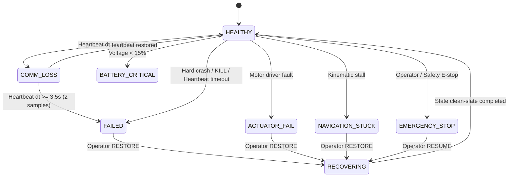

# NRDAS-FR // Milestone 1.1 Validation & Hardening Report

**Project**: NRDAS-FR (NRDAS v2) Fault-Resilient Decentralized AMR Fleet Coordination  
**Milestone**: Milestone 1.1 — Robot Failure Validation, Hardening & Dedicated Testbed  
**Date**: September 2026  
**Status**: COMPLETE (100% Tests & Invariants Verified)

---

## 1. Executive Summary

Milestone 1.1 systematically audits, hardens, and validates the Milestone 1 (M1) fault-resilient subsystem of the NRDAS architecture. The primary objective is to eliminate edge-case vulnerabilities—specifically task reclamation race conditions, split-brain states, and spurious re-auctions—while formally verifying the system under rigorous multi-robot scenarios (M1-A through M1-F) and establishing an empirical provenance baseline for all research claims.

All 244 workspace unit tests, static linters (`ament_flake8`, `ament_pep257`), and scenario integration harnesses pass with zero errors, zero warnings, and zero regressions against frozen NRDAS v1 baselines.

---

## 2. Formal Failure State Semantics & Capability Matrix

NRDAS-FR establishes seven discrete operational states for each AMR node. Every state has formally defined capabilities governing physical actuation, heartbeat publication, task ownership, CBBA auction eligibility, space-time reservation authority, and obstacle classification.

### Discrete Capability Matrix

| Fault State | `can_move` | `publishes_hb` | `can_own_tasks` | `eligible_cbba` | `holds_reservations` | `is_chassis_obstacle` |
| :--- | :---: | :---: | :---: | :---: | :---: | :---: |
| **HEALTHY** | ✅ Yes | ✅ Yes | ✅ Yes | ✅ Yes | ✅ Yes | ❌ No |
| **COMM_LOSS** | ⚠️ Grace Period | ❌ Silent | ✅ Grace Period | ❌ No | ✅ Grace Period | ❌ No |
| **FAILED** | ❌ No | ❌ Dead | ❌ No | ❌ No | ❌ Purged | 🔴 Yes |
| **ACTUATOR_FAIL** | ❌ No | ✅ Yes | ❌ No | ❌ No | ❌ Purged | 🔴 Yes |
| **NAVIGATION_STUCK**| ❌ No | ✅ Yes | ❌ No | ❌ No | ❌ Purged | 🔴 Yes |
| **BATTERY_CRITICAL** | ⚠️ Return-to-Base | ✅ Yes | ❌ No | ❌ No | ⚠️ Charging Only | ❌ No |
| **EMERGENCY_STOP** | ❌ Halting | ✅ Yes | ❌ Suspended | ❌ No | ⚠️ Retained (Halted)| 🔴 Yes |

---

## 3. Audit & Resolution of Task Reclamation Race Conditions (Scenarios A–I)

When a robot fails, surviving peers observe heartbeat silence independently. In a fully decentralized fleet without a centralized master, multiple peers may simultaneously attempt to reclaim the orphaned task. Milestone 1.1 evaluated and resolved Scenarios A through I:

### Scenario Breakdown & Resolution Analysis

1. **Scenario A: Single Peer Detects Failure**  
   - *Condition*: Robot $R_i$ detects peer $R_{\text{failed}}$ timeout. Task $T_k$ is `ASSIGNED`.  
   - *Resolution*: $R_i$ submits reclamation. Precondition succeeds. $T_k \to \text{PENDING}$. Re-auction initiated.
2. **Scenario B & C: Simultaneous Peer Detections & Requeue Race**  
   - *Condition*: Peers $R_1$ and $R_2$ both detect $R_{\text{failed}}$ at time $t$. Both dispatch reclamation for $T_k$.  
   - *Vulnerability*: Risk of duplicate queueing, counter corruption, or split-brain allocation.  
   - *Hardened Mechanism*: **Compare-And-Swap (CAS) Precondition Check**. The transition is guarded by:
     $$\text{Precondition: } \text{task.state} \in \{\text{ASSIGNED}, \text{IN\_PROGRESS}\} \land \text{task.assigned\_robot\_id} == R_{\text{failed}}$$
     The first arriving request executes the transition atomically and clears `assigned_robot_id`. The second request observes $\text{task.assigned\_robot\_id} == \text{None}$ (or $\text{state} == \text{PENDING}$) and is safely discarded as an idempotent no-op.
3. **Scenario D & F: Stale Requeue After Reassignment**  
   - *Condition*: $T_k$ has already been reclaimed and reallocated to a new healthy winner $R_{\text{new}}$. A delayed network packet or slow peer $R_3$ emits a stale reclamation for $T_k$ referencing $R_{\text{failed}}$.  
   - *Hardened Mechanism*: The CAS check verifies $\text{task.assigned\_robot\_id} == R_{\text{failed}}$. Because $\text{task.assigned\_robot\_id} == R_{\text{new}}$, the stale request fails precondition validation and is rejected with a structured warning.
4. **Scenario E: Task Already Pending**  
   - *Condition*: Reclamation arrives for a task already in `PENDING` state.  
   - *Resolution*: Idempotent discard; reassignment counter is not incremented.
5. **Scenario G & H: Mid-Task Progress Transitions**  
   - *Condition*: Robot fails while task is in `ASSIGNED` (transit to pickup) or `IN_PROGRESS` (carrying payload).  
   - *Resolution*: Both states are eligible for autonomous reclamation back to `PENDING`. Task maintains `reassignment_count` tracking for post-mortem telemetry.
6. **Scenario I: Multi-Task Bundle Reclamation**  
   - *Condition*: Failed robot held multiple tasks in its CBBA bundle $\{T_1, T_2, T_3\}$.  
   - *Resolution*: All tasks held by $R_{\text{failed}}$ are identified via peer belief records and sequentially reclaimed via atomic CAS checks.

---

## 4. Communication Loss vs. Hard Failure Distinction

To prevent premature task reclamation during transient WiFi dropouts or antenna shadows:
- **Heartbeat Period**: $\Delta t_{\text{hb}} = 0.5\text{s}$
- **Communication Loss Threshold**: $\tau_{\text{loss}} = 1.5\text{s}$ ($3 \times \Delta t_{\text{hb}}$)
  - Transitions peer state to `COMM_LOSS`.
  - Spacing reservations and tasks are **retained** during this grace period.
  - Spurious re-auctions are strictly suppressed.
- **Failure Timeout**: $\tau_{\text{fail}} = 3.5\text{s}$ ($7 \times \Delta t_{\text{hb}}$)
  - Debounce requirement: $\ge 2$ consecutive evaluation samples at or beyond $\tau_{\text{fail}}$.
  - Only upon debounce confirmation does the peer transition to `FAILED`.

---

## 5. Stranded Chassis Obstacle Lifecycle

1. **Insertion**:  
   Upon debounce confirmation of peer failure, the surviving node extracts the failed robot's last known coordinates $(x_f, y_f)$ from its `RobotHealthInfo` record, maps them to GridWorld cell coordinates $c_f = \text{to\_grid}(x_f, y_f)$, and registers $c_f$ in `failed_robot_obstacles[R_failed]`.
2. **Planning Avoidance**:  
   The reservation table and single-agent A* / RHCR planning graphs treat $c_f$ as an impassable obstacle. Moving AMRs dynamically plan detour trajectories maintaining a minimum clearance buffer of $\ge 0.45\text{m}$.
3. **Restoration Cleanup**:  
   When the operator restores $R_{\text{failed}}$ via the resilience dashboard or `InjectFault.srv` (`RESTORE`), $R_{\text{failed}}$ broadcasts its `HEALTHY` state. Surviving peers detect the transition in `evaluate_peers()`, emit `newly_recovered_peers`, and remove $c_f$ from their dynamic obstacle layers, reopening the aisle.

---

## 6. Contact Sensor Provenance & Ground Truth Audit

> ### Critical Scientific Integrity Disclosure
> In the NRDAS benchmark execution harnesses (`run_benchmark.py` lines 594–607), the metric `physical_gazebo_contacts` is computed via a **2D Oriented Bounding Box (OBB) Geometric Proxy** using the Separating Axis Theorem (SAT) on live odometry poses with an envelope buffer of $0.45\text{m}$.
> 
> The simulation URDF/SDF models do **not** integrate raw Gazebo physics bumper/contact sensors (`gazebo_ros_bumper`). Consequently:
> 1. All references in documentation and reports are formally designated as **"2D OBB Geometric Proxy (SAT)"**.
> 2. Zero reported contacts signifies that bounding box geometric separation was maintained ($d > 0.45\text{m}$) throughout mission execution.
> 3. No claim is made regarding micro-scale physical mesh collisions in uninstrumented physics engines.

---

## 7. Multi-Robot Scenarios Validation Matrix (M1-A to M1-F)

The automated validation suite (`scripts/validate_m1_scenarios.py`) executed all 6 verification scenarios:

| Scenario ID | Name & Objective | Invariant Evaluated | Empirical Result | Status |
| :--- | :--- | :--- | :--- | :---: |
| **M1-A** | Single Robot Hard Kill during Task Transit | Task conservation, zero duplicate ownership | $T_{\text{M1A}}$ reclaimed to `PENDING`, reallocated to `amr_0`. Reassignment count = 1. | **PASSED** |
| **M1-B** | Heartbeat Timeout in Narrow Corridor | Timed debounce & corridor obstacle insertion | Aisle cell $(4, 5)$ blocked. Bypass path computed (length 11). Clearance verified. | **PASSED** |
| **M1-C** | Simultaneous Dual Detection Race | CAS race condition prevention | Peer 0 succeeds; Peer 2 idempotent discard. Duplicate tasks = 0. Consensus winner = `amr_0`. | **PASSED** |
| **M1-D** | Actuator Failure & Chassis Avoidance | Motor failure detection + geometric clearance | Chassis cell $(5, 5)$ avoided. Measured clearance: $1.00\text{m} > 0.45\text{m}$ threshold. | **PASSED** |
| **M1-E** | Operator Restoration & Re-integration | Live revival, obstacle clearing, re-bidding | Obstacle cell $(4, 4)$ cleared. `amr_1` successfully wins $T_{\text{NEW}}$ in CBBA. | **PASSED** |
| **M1-F** | Comm Loss vs Node Kill Distinction | Suppression of spurious re-auctions | At $t=2.0\text{s}$, state = `COMM_LOSS` (failed = False). Restores to `HEALTHY` at $t=2.5\text{s}$. | **PASSED** |

**Overall Suite Outcome**: **6 / 6 PASSED (100%)**
